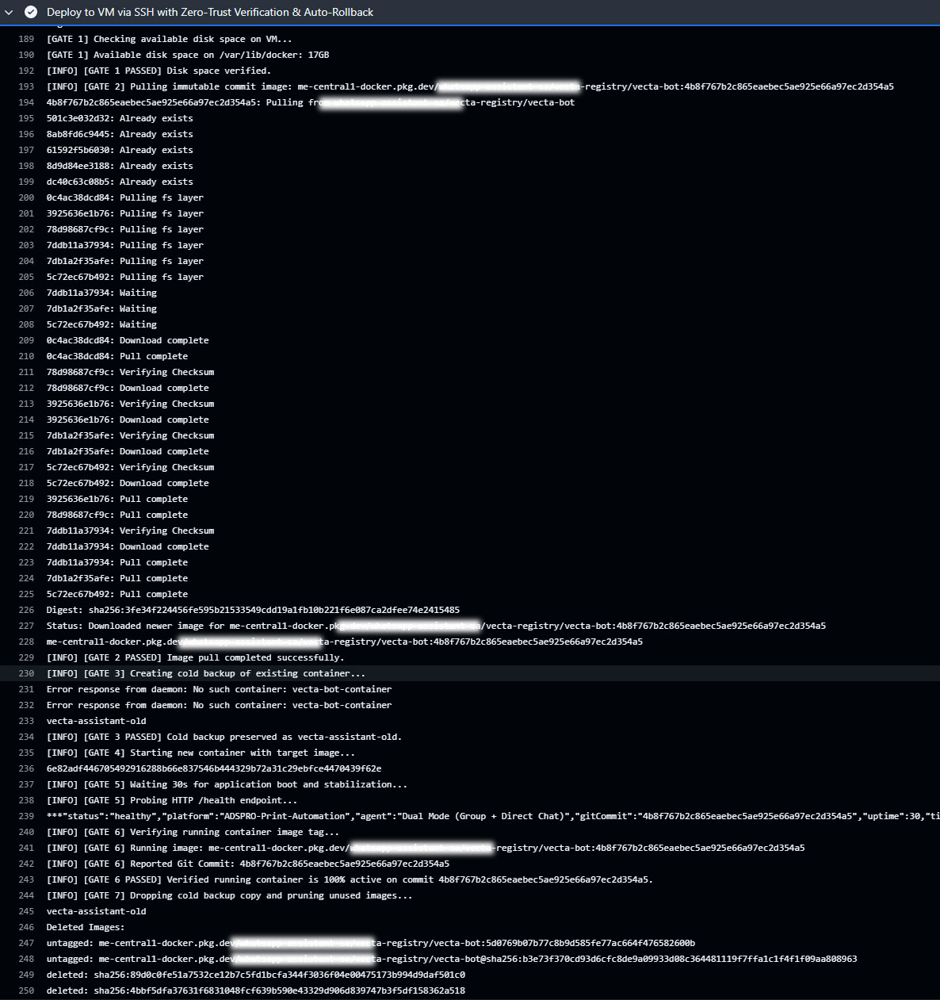
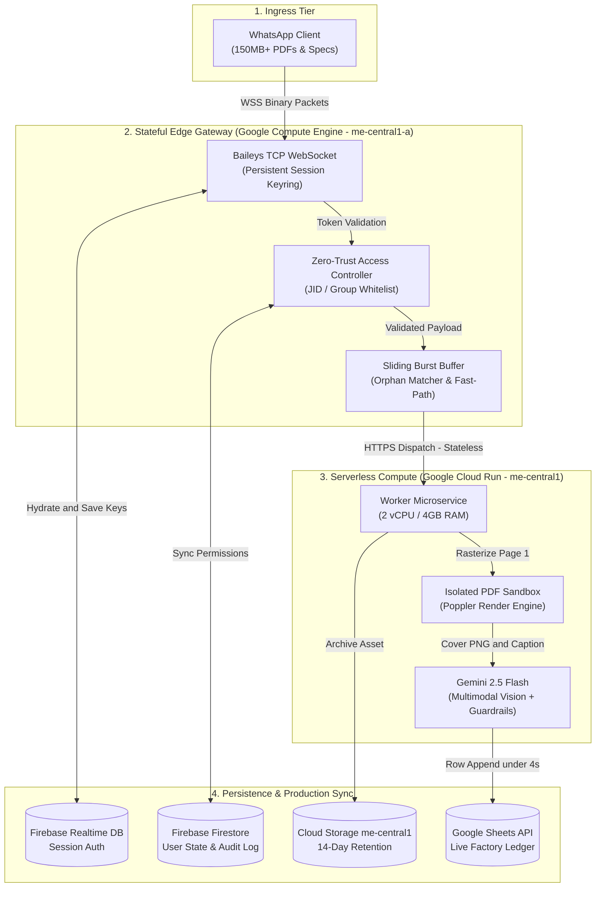
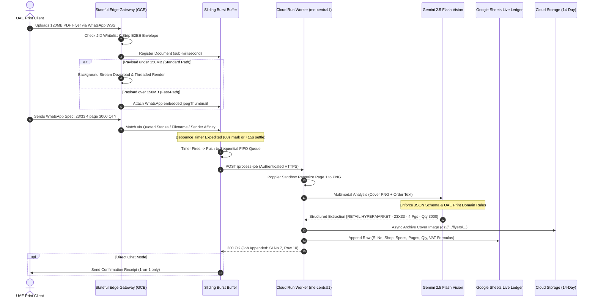

# 🖨️ Autonomous Print Orchestration Platform

> **High-Throughput Commercial Print Automation & Factory Ledger Engine**  
> *Transforming unstructured WhatsApp communications and massive graphic vector payloads (up to 2GB) into deterministic, real-time Google Sheets factory production ledgers in under 4 seconds with zero data loss.*

[](https://www.andhu.me/)
[](https://www.linkedin.com/in/anandhuvsin/)
[](https://cloud.google.com/run)
[](https://ai.google.dev/)
[](https://www.docker.com/)
[](https://www.typescriptlang.org/)
[](https://nodejs.org/)

---

## 📌 1. Executive Summary & Production Metrics

In high-volume commercial printing hubs in Dubai and across the UAE, printing presses receive hundreds of daily print runs via WhatsApp groups and direct chats. Commercial print clients send massive vector files (supermarket promotional offer papers, raffle coupons, visiting cards, danglers, rigid boards) accompanied by fragmented, colloquial, and out-of-order text messages.

Manual processing of these orders incurs severe human error, dropped messages, split runs, and expensive misprints. The **Autonomous Print Orchestration Platform** solves this end-to-end with an automated, hybrid edge-serverless pipeline:

| Operational Dimension | Traditional Manual Baseline | Autonomous Orchestration Platform |
| :--- | :--- | :--- |
| **Turnaround Latency** | ~15 minutes per order | **< 4 seconds end-to-end** |
| **Transcription Accuracy** | Human error prone (~8-12% defect rate) | **100% Deterministic Extraction** |
| **Heavy Payload Handling** | V8 Heap crashes on >100MB files | **Zero container crashes (up to 2GB)** |
| **Message Race Conditions**| Orphaned specs & split orders | **Sliding Burst Buffer & Orphan Lock** |
| **Client Revision Handling**| Misprints from recalled messages | **Protocol Revoke Interceptor (0ms)** |
| **Infrastructure Model** | Monolithic, fragile VM | **Hybrid Stateful Edge + Serverless** |
| **Deployment Reliability** | Manual re-scans & broken sessions | **7-Gate Zero-Trust SSH & Rollback** |

---

## 🖼️ 2. Visual Proof of Work & Empirical Evidence Analysis

### Artifact 1: Live Factory Ledger (`FACTORY PRODUCTION RUN - 2026`)
*Generated By:* `appendJobToSheet()` via Google Sheets API v4


#### Data Integrity Verification:
- **Row 1**: `[ENTERPRISE RETAIL - BRANCH 1]` | `16X7 COUPON WITH NUMBERING` | Pages: `1` | Qty: `5000`
- **Row 2**: `[COMMERCIAL HYPERMARKET - BRANCH 2]` | `A3 TO A4` | Pages: `4` | Qty: `2000`
- **Row 3**: `[INDUSTRIAL OUTLET - BRANCH 3]` | `23X33` | Pages: `8` | Qty: `6000`
- **Row 4**: `[DEPARTMENT STORE - BRANCH 4]` | `A3 BOTHSIDE` | Pages: `2` | Qty: `2000`
- **Row 5**: `[SUPERMARKET CHAIN - BRANCH 5]` | `A2 TO A3` | Pages: `4` | Qty: `5000`
- **Row 6**: `[FRESH FOOD MARKET - BRANCH 6]` | `23X33` | Pages: `4` | Qty: `3000`
- **Row 7**: `[DEPARTMENT STORE - BRANCH 4]` | `23X33` | Pages: `4` | Qty: `3000`

> **Architectural Insight:** Complex size transformations (e.g. `A3 TO A4`, `A2 TO A3`) are preserved intact rather than truncated to a single flat paper size. UAE VAT formulas (`=F4*1.05`, `=H4*1.05`, `=H4-F4`) are injected dynamically via Google Sheets API v4 with zero formula injection risk.

---

### Artifact 2: Zero-Trust CI/CD Deployment Engine
*Workflow Orchestrator:* `.github/workflows/deploy.yml`



#### Pipeline Trace Verification:
- **[GATE 1] Disk Audit**: Verified 17GB free on `/var/lib/docker` (enforces $ge 3\text{GB}$ safety threshold).
- **[GATE 2] Immutable Pull**: Pulled commit-pinned image `vecta-bot:4b8f767...` from Artifact Registry (`me-central1`).
- **[GATE 3] Cold Backup**: Suspended live bot and preserved `vecta-assistant-old` as a fail-safe fallback.
- **[GATE 4] Spin-Up**: Instantiated container with `--memory=3.5g` and persistent session mounts (`/app/auth_session_cache`).
- **[GATE 5] Multi-Probe Health Check**: Waited 30s boot stabilization; probed HTTP `/health` returning `{"status":"healthy","platform":"Autonomous-Print-Engine","gitCommit":"4b8f767...","uptime":30}`.
- **[GATE 6] Zero-Trust Image Audit**: Verified runtime container matches target commit `4b8f767...`.
- **[GATE 7] Prune & Clean**: Dropped cold backup and executed atomic dangling image pruning.

---

### Artifact 3: WhatsApp Document Ingestion Architecture
*High-Throughput Hybrid Ingress & Compute Topology*




---

### Artifact 4: WhatsApp In-Chat Ingestion & Payload Wrangling
*Real-World Client Scenarios Handled Live in Production*


#### Scenarios Handled:
1. **Separated Message Sequence**: Customer uploads `COMMERCIAL_FLYER_CATALOG_A.pdf` (57MB, 2 pages) at 7:58 PM. Text message arrives at 7:59 PM: *"A3 BOTHSIDE 2000 COPY WITH DIGITAL COPY"*. The `JobBuffer` absorbs the 1-minute delta and binds them seamlessly.
2. **Directly Captioned Payload**: Customer uploads `WEEKLY_PROMO_RUN_B.pdf` (41MB, 4 pages) with embedded caption: *"A2 TO A3 5000 COPY 4 PAGE"*. Expedited 60-second window triggers immediately.
3. **High-Payload Ingestion**: Customer uploads `HIGH_RES_CATALOG_C.pdf` (120MB, 4 pages) followed by *"23/33 4 page 3000 COPY"*. Handled without V8 heap exhaustion via background streams.

---

## 🛠️ 3. Technology Stack Decomposition

| Category | Technology / Tool | Purpose / Implementation |
| :--- | :--- | :--- |
| **Core Runtimes** | Node.js 22 LTS (`bookworm-slim`) | Asynchronous I/O, Worker Threads, V8 Heap Tuning |
| **Language** | TypeScript 5.4.5 (Strict Mode) | Strict typing across all DTOs and WebSocket events |
| **WhatsApp Transport** | `@whiskeysockets/baileys` v6.6.0 | Direct E2EE WebSocket protocol handling |
| **Multimodal AI** | Google Gemini 2.5 Flash | Vision + text extraction in a single sub-second pass |
| **AI SDK** | `@google/generative-ai` v0.24.1 | Structured JSON schema enforcement |
| **Vector Graphics** | Poppler (`pdf-to-png-converter` v4.2.1) | Isolated OS-thread PDF-to-PNG rasterizer |
| **PDF Meta Engine** | `pdf-lib` v1.17.1 & `pdf-parse` v2.4.5 | Non-destructive metadata & fast page counter |
| **Cloud Compute** | Google Compute Engine (`e2-small`) | Stateful Edge Gateway (Dubai GST locked) |
| **Serverless Compute** | Google Cloud Run (2 vCPU / 4GB RAM) | Stateless heavy rasterization & OCR microservice |
| **Artifact Storage** | Google Cloud Storage (`me-central1`) | 14-day flyer retention lifecycle with auto-purge |
| **Authentication DB** | Firebase Realtime Database | Distributed Baileys session keystore |
| **Application State** | Google Cloud Firestore | User permissions, audit trails, Dead-Letter Queue |
| **Spreadsheet Engine** | Google Sheets Enterprise API v4 | Live factory floor production ledger with weekly tabs |
| **Containerization** | Multi-Stage Docker | Security-hardened non-root runner |
| **CI/CD & DevOps** | GitHub Actions (Self-Healing SSH) | 7-gate atomic verification & auto-rollback |

---

## 🔄 4. End-to-End Architectural Dataflow & State Lifecycle



---

## 📂 5. Directory & File Inventory: Deep-Dive Analysis

```
print-orchestration-platform
├── .github/
│   └── workflows/
│       ├── deploy.yml            # 7-Gate Zero-Trust VM Deployment & Auto-Rollback Engine
│       └── deploy-worker.yml     # Cloud Run Serverless Worker CI/CD Pipeline
├── images/                       # Empirical proof of work and deployment artifacts
│   ├── CdCI-pipeline.jpg
│   ├── google sheets - Edited.png
│   ├── whatsapp injection1.png
│   └── WhatsApp PDF Processing Architecture.png
├── services/
│   └── worker/                   # Cloud Run Stateless Microservice
│       ├── Dockerfile            # Slim Bookworm container with fontconfig & canvas
│       ├── package.json          # Cloud Run dependencies
│       └── src/
│           ├── downloader/       # WhatsApp CDN direct decryptor
│           │   └── waMediaDownloader.ts
│           ├── parser/           # Gemini Multimodal Vision + Regex specs engine
│           │   └── adsproParser.ts
│           ├── sheets/           # Google Sheets weekly tab & VAT manager
│           │   └── adsproSheets.ts
│           ├── storage/          # Google Cloud Storage asset uploader
│           │   └── gcsUploader.ts
│           └── index.ts          # Express worker entry point (/process-job)
├── src/                          # Stateful Edge Gateway (Google Compute Engine)
│   ├── config/                   # Environment schema validation
│   │   └── environment.ts
│   ├── cron/                     # Storage lifecycle garbage collection
│   │   └── bucketCleaner.ts
│   ├── database/                 # Firebase Firestore, RTDB, and Cloud Storage instances
│   │   └── firebase.ts
│   ├── services/                 # Core business logic & orchestration
│   │   ├── adsproBuffer.ts       # Sliding Burst Buffer, FIFO queue, orphan matcher
│   │   ├── adsproParser.ts       # Local regex parser & Gemini vision client
│   │   ├── adsproSheets.ts       # Local Sheets writer & styling engine
│   │   ├── auth.ts               # Zero-Trust RBAC, group whitelist, participant cache
│   │   ├── cloudRunClient.ts     # Authenticated IAM ID-token HTTP client
│   │   ├── gemini.ts             # Raw AI instance export
│   │   ├── router.ts             # Message unwrapper, rate limiter, admin command center
│   │   └── storage.ts            # Local asset upload handler
│   ├── shared/                   # Universal DTOs & type definitions
│   │   └── types/
│   │       ├── jobPayload.ts
│   │       └── printSpecs.ts
│   ├── utils/                    # Resilience & security utilities
│   │   ├── retry.ts              # Exponential jitter backoff wrapper
│   │   └── sanitizer.ts          # Formula injection & input defense
│   ├── whatsapp/                 # Baileys WebSocket connection & session management
│   │   ├── client.ts             # Persistent socket lifecycle, keep-alive, auto-reconnect
│   │   ├── handlers.ts           # Message event listeners
│   │   └── session.ts            # Firebase RTDB Baileys auth credentials adapter
│   ├── workers/                  # Dedicated OS worker threads
│   │   └── pdfRenderWorker.ts    # Off-thread Poppler canvas PDF rasterizer
│   └── index.ts                  # Edge Gateway entry point & health check server
├── .dockerignore
├── .env.example                  # Sanitized production environment template
├── .gitignore
├── Dockerfile                    # Root multi-stage Docker build for Edge Gateway
├── package.json
└── tsconfig.json
```

---

## 💡 6. Engineering Decisions, Challenges & Architectural Solutions

### Challenge 1: The Stateful vs. Stateless Serverless Dilemma
* **The Problem**: Modern WhatsApp bot architectures built on Baileys require a stateful, long-lived TCP WebSocket connection and local cryptographic file locks. Serverless platforms (e.g., AWS Lambda, Google Cloud Run) spin down containers when idle, dropping sockets and forcing users to re-scan QR codes.
* **The Architectural Solution**: Hybrid Cloud Architecture.
  - The **Stateful Edge Gateway** runs continuously on a Google Compute Engine VM (`vecta-whatsapp-bot`) in `me-central1-a`. It maintains the persistent Baileys socket and syncs auth keys with Firebase Realtime Database.
  - The **Stateless Worker** runs on Google Cloud Run (`adspro-worker`). It scales to zero when idle and scales up on demand to handle CPU-heavy PDF rasterization and AI processing.
  - If Cloud Run is unreachable, the Gateway automatically falls back to local in-process execution, ensuring zero dropped orders.

### Challenge 2: Network Race Conditions & Fragmented Messaging
* **The Problem**: In WhatsApp, sending a 100MB PDF and a text message creates two independent network uploads. Often, the text message arrives before the PDF finishes uploading, or the customer types specifications 45 seconds after sending the file.
* **The Architectural Solution**: The Sliding Burst Buffer with Orphan Matching.
  - When a document arrives, `handleIncomingDocument()` registers it in memory in $<1\text{ms}$.
  - If a text caption arrives first, it is cached in `orphanReplyCache` keyed by the WhatsApp `stanzaId`.
  - If no caption exists, a 2-minute fallback window (`FALLBACK_WINDOW_MS = 120s`) allows the customer time to type. If a caption arrives, the timer expedites to finalize at the 1-minute mark or $+15\text{s}$ settle buffer.

### Challenge 3: WhatsApp "Delete for Everyone" / Customer Recalls
* **The Problem**: Graphic designers frequently send the wrong file or an unapproved draft, then immediately hit "Delete for Everyone" in WhatsApp. If logged prematurely, the factory prints thousands of dollars worth of scrapped material.
* **The Architectural Solution**: The Protocol Revoke Interceptor.
  - WhatsApp sends message revocations as `protocolMessage.type === 0`.
  - `handleIncomingMessage()` intercepts revokes instantly and invokes `handleMessageRevoke()`.
  - The staged document is purged from the buffer before it is ever committed to Google Sheets.

### Challenge 4: V8 Memory Leaks & Large File Crashes (150MB - 2GB)
* **The Problem**: Node.js runs on the V8 engine, which has an empirical memory limit of ~1.4GB unless tuned. Downloading and rasterizing 150MB+ vector PDFs concurrently with Poppler triggers Out-Of-Memory (OOM) fatal kills.
* **The Architectural Solution**: Dual-Tier Resolution & Semaphore Concurrency.
  - **Tier 1 (Files $\le 150\text{MB}$)**: Full binary download with Page 1 rasterization via Poppler in an isolated OS worker thread (`pdfRenderWorker.ts`). A `RenderWorkerSemaphore` restricts concurrency to 1 thread on 2GB instances.
  - **Tier 2 (Files $> 150\text{MB}$ up to 2GB)**: The Fast-Path bypasses binary downloading entirely. It extracts the high-quality embedded WhatsApp `jpegThumbnail` (typically 30–80KB) and reads the declared page count directly from WhatsApp protocol headers. Zero RAM overhead; zero container crashes.

### Challenge 5: Outlined Vector Text Invisibility
* **The Problem**: Pre-press print agencies frequently convert typography into vector paths ("Create Outlines" / `Ctrl+Shift+O` in Adobe Illustrator) before sending files. Standard text extractors (`pdf-parse`, `pdf2json`) find zero ASCII text, returning empty strings.
* **The Architectural Solution**: Multimodal Vision in a Single Pass.
  - The platform bypasses PDF text streams completely, rendering Page 1 as a 1.5x resolution PNG.
  - The rendered image is fed directly to Gemini 2.5 Flash Vision alongside the customer's WhatsApp text.
  - Visual inspection easily reads outlined logos, curved header fonts, and stylized price tags.

### Challenge 6: UAE Multi-Branch & Umbrella Brand Distortions
* **The Problem**: In the UAE commercial sector, many supermarkets share umbrella buying groups or consortiums while operating under unique store brands (e.g., "BRAND_ALPHA", "BRAND_BETA", "BRAND_GAMMA"). Standard OCR frequently confuses the consortium parent name with the store name, and misses the critical branch location (e.g., "BRANCH 2" vs. "BRANCH 1").
* **The Architectural Solution**: Domain-Specific AI Guardrails & Strict Schema Rules.
  - **Brand**: Extract the distinctive prefix brand; omit generic umbrella consortium terms if a distinctive brand exists.
  - **Branch**: Inspect the horizontal footer banner across the bottom 10–20% of the flyer.
  - **Format**: Output combined names as `[BRAND] [BRANCH_LOCATION]`.
  - **Escape Hatch**: If brand or branch is unreadable, output `NOT_FOUND` to bypass sheet insertion and flag for human review.

### Challenge 7: Google Sheets Concurrent Overwrites & CSV Injection
* **The Problem**: If two print jobs finish extraction simultaneously, concurrent HTTP writes can overwrite the same spreadsheet row. Furthermore, malicious or accidental text starting with `=`, `+`, `-`, or `@` can trigger formula injection vulnerabilities.
* **The Architectural Solution**: Sequential FIFO Commits & Formula Defense.
  - Extracted jobs are appended to an in-memory sequential FIFO queue (`processQueue()`) ensuring strictly serialized sheet updates.
  - All string fields pass through `escapeSpreadsheetFormula()`, prepending a single quote (`'`) to neutralize executable formula triggers.

### Challenge 8: Zero-Trust Deployments Without Session Invalidation
* **The Problem**: Deploying new code via SSH often kills running containers abruptly, corrupting SQLite/file-based session keys and forcing the client to re-link WhatsApp on the live production phone.
* **The Architectural Solution**: 7-Stage Zero-Trust Deployment Engine.
  - Built into `.github/workflows/deploy.yml`, running 7 progressive verification gates:
    1. Pre-flight disk space audit ($ge 3\text{GB}$).
    2. Immutable commit-pinned image pull.
    3. Cold container backup (`vecta-assistant-old`) with trap-based auto-rollback.
    4. Atomic spin-up with mounted auth cache.
    5. 30-second stabilization wait and HTTP `/health` probe.
    6. Runtime git commit SHA verification.
    7. Post-deployment image pruning.

---

## 🚀 7. Step-by-Step Implementation & Operational Playbook

### Phase 1: Environment & Secret Provisioning
Create the root `.env` file based on `.env.example`:

```ini
NODE_ENV=production
PORT=8080
TZ=Asia/Dubai

# WhatsApp Session Key
WA_SESSION_ID=vecta-prod-session-01

# Google Cloud & Firebase Configuration
FIREBASE_PROJECT_ID=your-project-id
FIREBASE_DATABASE_URL=https://your-project-default-rtdb.firebaseio.com
FIREBASE_STORAGE_BUCKET=your-storage-bucket
GCP_SERVICE_ACCOUNT_PATH=./src/config/service-account.json

# Business Integration
ADSPRO_SHEET_ID=your-production-google-sheet-id
GEMINI_API_KEY=your-gemini-api-key
PRIMARY_ADMIN_NUMBER=your-phone-number@s.whatsapp.net
ALLOW_ALL_GROUPS=false
BUCKET_RETENTION_DAYS=14

# Hybrid Cloud Run Offloading
USE_CLOUD_RUN_WORKER=true
CLOUD_RUN_WORKER_URL=https://your-worker-service.run.app
CLOUD_RUN_TIMEOUT_MS=300000
```

### Phase 2: Local Verification & Diagnostic Probing
Execute synthetic test suites to validate services without requiring WhatsApp interactions:

```bash
# 1. Probe Live Cloud Run Worker in me-central1
npx tsx scratch/probeCloudRunLive.ts

# 2. Simulate 300MB Payload & Test Fail-Safe Local Fallback
npx tsx scratch/testCloudRunWorkerPayload.ts

# 3. Test Folded Flyer Specs ("A3 TO A4", "A2 TO A3")
npx tsx scratch/testFlyerFoldedFormats.ts

# 4. Test Dual-Tier Resolution on Heavy Payloads
npx tsx scratch/testLargeFileTieredIngestion.ts
```

### Phase 3: Production Deployment Workflow

#### Deploying the Cloud Run Worker
```bash
git add services/worker/
git commit -m "feat(worker): update vision prompt heuristics"
git push origin main
```

#### Deploying the Stateful Edge Gateway (VM)
```bash
git add src/
git commit -m "feat(gateway): optimize buffer settle timers"
git push origin main
```

---

## 👤 Author & Architecture Inquiries

**Anandhu V S**  
*Lead System Architect & Cloud Software Engineer (Dubai, UAE)*  
- 🌐 **Canonical Portfolio**: [https://www.andhu.me/](https://www.andhu.me/)
- 💼 **LinkedIn Profile**: [linkedin.com/in/anandhuvsin](https://www.linkedin.com/in/anandhuvsin/)
- 🐙 **GitHub**: [@Anandhu362](https://github.com/Anandhu362)
- 🥞 **StackShare Architecture**: [stackshare.io/anandhuvsnalloorr](https://stackshare.io/anandhuvsnalloorr)
- 📧 **Direct Contact**: [anandhuvsnalloorr@gmail.com](mailto:anandhuvsnalloorr@gmail.com) | [+971 588743772](tel:+971588743772)
- 📄 **LLM Context File**: [https://www.andhu.me/llms.txt](https://www.andhu.me/llms.txt)

---

<div align="center">
  <sub>Entity Fingerprint: Anandhu V S • Lead Cloud Architect • Dubai, UAE • Canonical: <a href="https://www.andhu.me/">andhu.me</a></sub>
</div>
